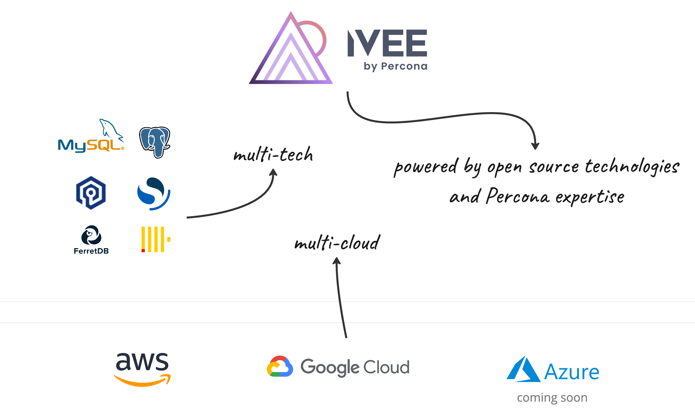

# Welcome to Ivee by Percona

## Simplify your database management

Ivee by Percona is a fully managed Database-as-a-Service (DBaaS) that empowers developers and businesses to focus on building applications, not managing databases. With Ivee, you can effortlessly deploy, scale, and manage popular databases like MySQL, PostgreSQL, Valkey and others on your preferred cloud provider – AWS, GCP, or Azure. 

## Try for free

Create an account and deploy your databases for free.

[Create a free account:material-arrow-right:](https://app.ivee.cloud/singup){.md-button } 
